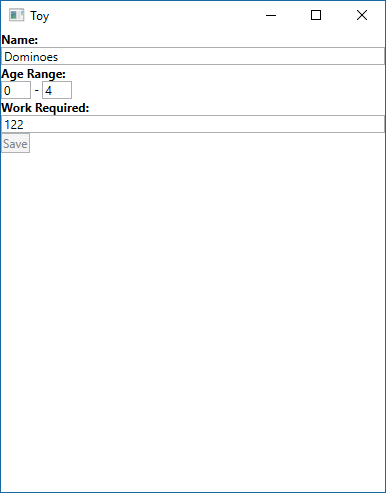

# Functional Event Sourcing meets The Elm Architecture #

**By Anthony Lloyd**

<sub>Original post dated 2016-11-27 available at https://anthonylloyd.github.io/blog/2016/11/27/event-sourcing</sub>

<sub>All text and code copyright (c) 2016 by Anthony Lloyd. Used with permission.</sub> 

One of the highlights of the year for me was the [farewell to FRP](http://elm-lang.org/blog/farewell-to-frp) post by Evan Czaplicki.
For a long time, I've been looking for a simple functional alternative to the MVC UI models.

There are a number of [FRP](https://en.wikipedia.org/wiki/Functional_reactive_programming) alternatives but they all have limitations.
They use signals heavily and many have inherent memory leak issues.

Czaplicki removed signals, simplifying the model dramatically.
It resulted in something truly beautiful. A simple and composable way of building UIs.

Event Sourcing is also a compelling pattern I have found very useful. In some domains like accounting it is a perfect fit.

This post explores how Functional Event Sourcing fits with [the Elm Architecture](https://guide.elm-lang.org/architecture/index.html) covered in a previous [post](https://anthonylloyd.github.io/blog/2016/06/20/fsharp-elm-part1).
A combined festive WPF application is developed to streamline Santa's workload. The application code can be found [here](https://github.com/AnthonyLloyd/Event).

## Functional Event Sourcing

### Event

```fsharp 
type EventID = EventID of time:DateTime * user:UserID
```

An event is something that happens at a specific point. In physics an event is a change that happens at a point in spacetime.
In event sourcing the point is a unique identifier of the event.

In most systems this can just be the time and user who created the event.
This `EventID` can also include additional data required to make it unique.

The example application uses `Stopwatch` to increase the precision of `DateTime`.
The application also ensures each `EventID` time is unique. NTP servers could also be used to calibrate the application if a comparison of time between different machines is required.

As well as being a unique identifier of the event the `EventID` also satisfies all the data requirement for audit.

### Aggregate

```fsharp
type 'Aggregate ID = Created of EventID

type 'Aggregate Events = (EventID * 'Aggregate list1) list1
```

An aggregate is a collection of events that are bound together by a root entity. External entities can only hold a reference to the root entity identifier. An aggregate is a unit of consistency that has atomicity and autonomy.

In the example application we have the following domain model. Each case represents a possible change to the aggregate.

```fsharp
type Work = uint16
type Age = byte
type Behaviour = Good | Mixed | Bad

type Toy =
    | Name of string
    | AgeRange of lo:Age * hi:Age
    | WorkRequired of Work

type Elf =
    | Name of string
    | WorkRate of Work
    | Making of Toy ID option

type Kid =
    | Name of string
    | Age of Age
    | Behaviour of Behaviour
    | WishList of Toy ID SetEvent
```

Most of the events are simple field changes but events such as `Recalled` for `Toy` are possible.

The rules for domain model schema migration and data serialization are

* Cases cannot be removed or their data type changed
* Cases cannot be reordered
* Cases can be added (legacy code needs to ignore these)
* Cases can be renamed

[FsPickler](http://mbraceproject.github.io/FsPickler/) can be configured to comply with these rules, making it easy to serialize events.

### Store

```fsharp
type 'Aggregate MemoryStore =
    {
        Latest: Map<'Aggregate ID, 'Aggregate Events>
        Observers: IObserver<Map<'Aggregate ID, 'Aggregate Events>> list
    }
```

Stores are the databases of event sourcing. They can be in memory, remote or disconnected for example.

Many different concurrency models are possible. In the example application we have linear event sourcing with optimistic concurrency
which is the simplest and corresponds to most relational database applications.
`
More fine grained concurrency is possible and `Making` on `Elf` would be a good candidate as only the Santa process changes this.
Advanced concurrency models are also possible with event sourcing where events are designed to commute such as [CRDTs](https://en.wikipedia.org/wiki/Conflict-free_replicated_data_type).
These enable disconnected systems. Git is an example of a successful disconnected system.

### Benefits of functional event sourcing

* The only model that does not lose data
* Built in audit log
* View any previously generated report
* Temporal querying
* Preserves history, questions not yet asked
* Well defined and simple schema migration
* Zero data persistence code, no ORM problem
* Easier testing - regression, time travel debug

## Example Application


The application has two background processes running continuously. The first is the kids process that randomly adds and removes toys to the kids' Christmas wishlists. The second is the Santa process that assigns free elfs to make toys in the priority order of kid behaviour and request time.

All the screens update in realtime and any of the entities in the domain can be edited. All the entity edit screens have validation at both the field and aggregate level. A field editor Elm app was reused across all these fields.

The previous F# Elm implementation was extended to include subscriptions and commands. Minimal UI styling functionality was also added.


  

## Conclusion

This turns out to be quite a complicated problem we have solved. It would be interesting to see a more traditional solution in OO and a relational data model.
I can only imagine that both the domain model and code would be much more complicated.

One caveat with event sourcing would be that cross aggregate transactions are not possible.
This may take a little thinking to become comfortable with. It is possible to express two phase commits explicitly in the domain model.
Being explicit about these may also tease out the correct business requirements and lead to a better solution.

Functional Event Sourcing fits naturally with the subscription and command model in Elm.
Time travel debug and easy regression are features of both patterns and work well together.
The patterns result in a highly type safe and testable system.

I would recommend functional event sourcing in any application where strong audit or schema evolution are a requirement.
Linear event sourcing, optimistic concurrency and persisting each type to a single database table would be a natural starting point.

Hopefully F# will get Santa's follow up present delivery project. Happy holidays!

