# Introduction to Azure IoT with Fsharp #

*By William Berry. Original post at: http://www.lucidmotions.net/2016/11/introduction-to-azure-iot-with-fsharp.html*

**Requirements:**

* IDE/Editor with Fsharp capabilities, e.g. Visual Studio or VS Code with Ionide plugin. 
* Azure Subscription.
* Nuget or Paket

**Estimated Completion Time: 2-3 hours**

## A Brief Introduction 

Beating the drum of strongly typed function programming in the land of IoT is the textbook definition of counterculture.
Embedded systems have been written in "high-level" languages like C/C++ forever.
New players to the IoT market yearn for broad-based adoption and think the only way to drive developer adoption is to JavaScript All The Things!
While precedent and low barrier to entry are certainly compelling, neither are helping us build better, more robust, provably secure or correct systems.
As such, I think there is a very strong case for languages like F#, especially when leveraging opensource cross-platform run-times and sdks like .Net Core.

The goal of this introductory tutorial will be to show how F# fits into the world of IoT while simultaneously providing a broad architectural overview of an Azure IoT solution. 

Happy Coding,
Bill

## Data Simulation  

For this tutorial, we'll be simulating wind speed measurements taken from an array of devices.
The data will include nested objects like geo-coordinates and observation times.  We'll transmit this data from a device simulator that will act as a field gateway device and publish the data to an Azure IoT Hub.  Further post-processing steps will leverage an array of Azure PaaS offerings and harness the power and simplicity of F# all the way through to data visualization.

Though we will be hand rolling the data generators, one could just as easily leverage community libraries like FsCheck, which include wonderful APIs for randomized data generation.

## Project Scaffold

To complete this tutorial, we'll need two (2) empty projects created in a Visual Studio Solution.  The solution name is up to you; but, I would suggest the following names for the projects as they align with Microsoft's iot-samples library.

* `RegisterDevices` - the project that will be used to register simulated devices with our Azure IoT Hub.
* `DeviceSimulator` - the application that will simulate our IoT device(s) field gateway. 

## Configuration 

To save ourselves from hard coding connection strings and keys, let's build a configuration file that can be used across all the applications, and have fun with an F# Type Provider while we are at it.

In your solution add a folder call `config` and create a new file in that folder called `config.yaml`.  We'll need two primary groups of configuration information, one group for our Azure Cloud settings and one group for the simulated device(s).  The cloud settings section will need to store the URI of our IoT Hub, the IoT Hub's Event Hub compatible endpoint for reading device to cloud messages and a connection string to the IoT Hub, which will be used for device registration and other tasks.  I should note at this point that you can obviously build up the connection string from it's elements, removing the copy pasta, but that will be left as an exercise for you.

The following text can be pasted into your config.yaml file, replacing the `{foo}` parts with your IoT Hub's settings which we'll collect in the next section.  Also, don't worry about the Device `Key` yet, we'll get that filled in via registration code in a subsequent section. 

```
AzureIoTHubConfig:
  IoTHubUri: {hub name}.azure-devices.net
  IotHubD2CEndpoint: messages/events
  ConnectionString: HostName={hub name}.azure-devices.net;SharedAccessKeyName=iothubowner;SharedAccessKey={my shared access key}
DeviceConfigs:
  - Nickname: My Test Device
    DeviceId: DeviceId
    Key: {my device key}
    Status: Enabled
```


## Creating an Azure IoT Hub

Log into the Azure Portal, if you don't have an account you can sign up for a free one here that will supply you with $200 of free credit.  This demo solution is very light on Azure resources, so don't worry about draining your free credits, even if you leave it running for a few days. 

Once you are logged into the portal select the `+` icon in the top left corner of the screen and search for `IoT Hub`.

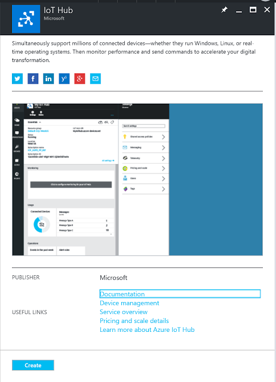

After selecting the resource press `Create` in the lower left corner of the newly presented blade.

You'll be subsequently prompted to enter configuration information for the IoT Hub.  There are only a few settings here worth mentioning:

* In the `Pricing and Scale Tier` menu, be sure to click into it and select the `Free` tier.  This will provide you with more than enough of a daily messaging rate to complete this tutorial and continue exploring on your own.
* Select one (1) IoT Hub Units, if it's not already populated.
* Change the `Device to Cloud Partitions` count to two (2).  This setting helps with scale out for the Hub and having fewer partitions will ease experimentation with reading Device to Cloud messages later.  For further reading, check out this introductory article on Event Hubs to understand the mechanics behind partitions.  
* Make sure to select `create new` for the Resource Group setting, this will allow for easy resource clean up later.
* Select an available region that is within your legal jurisdiction and/or close to your geographic local.  Please note that data generated by your IoT solutions such as latitude/longitude, city/state/province, postal code, occupancy or facility egress, and/or other pieces of end user information, may be considered Personally Identifiable Information (PII).  As such, many countries govern where this data can be transmitted and where and how it can be persisted, even temporarily.  It is up to you, the developer, to maintain compliance with these regulations - consult legal aid if you do not fully understand these requirements.   

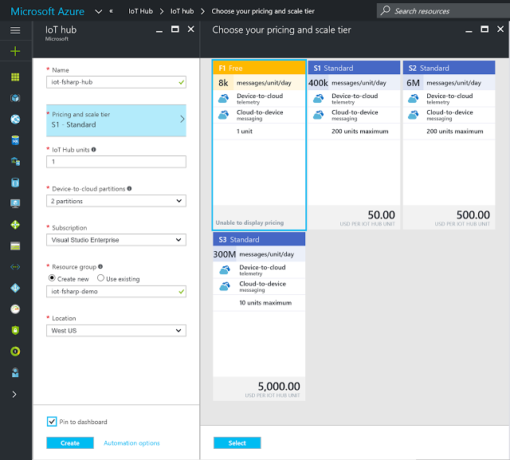

After entering the IoT Hub configuration information, press `Create` - you will be returned to the your Portal Dashboard while Azure sets up the Hub.  Now would be a great time for an espresso!

(a few minutes later)

With an espresso in hand, navigate to the newly created IoT Hub.  While it's worth exploring all the good information presented in the Hub's main portal blade, we'll need to make note of a few specific things before writing the application code.

In the section labeled `Overview`, copy the IoT Hub's `host name` value into the config.yaml file's `IoTHubUri` setting.  My IoTHubUri value will be `iot-fsharp-hub.azure-devices.net`.

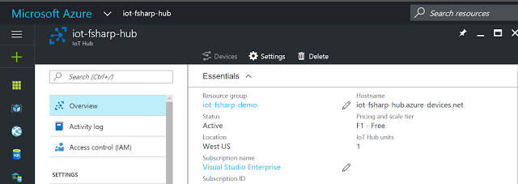


Scroll down the list of sections until you find the `Shared access policies` entry and click on it.  The blade will be extended with access accounts - select the `iothubowner` account.  Please note that for anything beyond toy solutions, fine tuned access controls that restrict user and subsystem permissions is imperative. Giving an application or other user the `iothubower` permission level is a recipe for a security disaster!

Once the `iothubowner` entry is selected, a new blade will be presented with security information.  Copy the `Connection string - primary key` value into the config.yaml file's 'ConnectionString` setting.


Continuing with the laundry list of disclaimers ... note that the portal has provided you with two (2) keys and two (2) corrosponding connection strings which include those keys in their bodies.  All applications that connect to the IoT Hub should have the capability to fail over between theses keys to ensure application up-time.  Also note that you'll want to develop a method for key rotation that meets your security requirements.  Though the posts are a bit old (2012), I suggest reviewing Bruce Kyle's awesome Windows Azure Security Best Practices series, to help your develop a cloud security mindset. 

With our configuration set up, let's get to writing some F#!

## Device Registration 

The next step along this IoT journey will be to write a small application that registers the simulated device with the IoT Hub; this process will generate a key that will subsequently be stored in the config.yaml file.

With the solution open in Visual Studio open the Package Manager Console - `Tools > Nuget Package Manager > Package Manager Console`.
Select the `DeviceIdentity` project and run the following commands to install the application's dependencies:

* Install-Package Fsharp.Configuration
* Install Package Microsoft.Azure.Devices

We are pulling in the Fsharp.Configuration package because it includes a YAML type provider that we'll use to easily parse the config.yaml file.

The application code will start simply by opening the dependent libraries, creating a `Config` type using the YAML Type Provider and then printing out to the console the Hub's connection string.

```
open System
open System.Linq
open FSharp.Configuration

type Config = YamlConfig<FilePath="../config/config.yaml">

module Main = 
    
    [<EntryPoint>]
    let main argv = 
        let config = Config()
        let configFilePath = "../../../config/config.yaml"
        config.Load(configFilePath)
        
        printfn "%s" config.AzureIoTHubConfig.ConnectionString
        
        let console = Console.ReadLine()
        0 // return an integer exit code
```

With the shell of the registration application reading from the config file, we now need code to create an IoT Hub Registry Manager, add devices, upgrade our key printing capabilities and persist the Azure generated Device Key to the config.yaml file.  So in that order:

```
let registryManager = RegistryManager.CreateFromConnectionString(connectionString)

let addDevice deviceId = registryManager.AddDeviceAsync(new Device(deviceId))

let printDeviceKey (device: Device) = printfn "Generated device key: %A" device.Authentication.SymmetricKey.PrimaryKey
 
let writeDeviceKey (device : Device) = 
            config.DeviceConfigs
            |> Seq.iter (fun dc -> 
                    if String.Compare(dc.DeviceId, device.Id) = 0 then
                        dc.Key <- device.Authentication.SymmetricKey.PrimaryKey
                )
            config.Save(configFilePath)
            device
            
addDevice deviceId 
|> Async.AwaitTask 
|> Async.RunSynchronously 
|> writeDeviceKey
|> printDeviceKey
```


The above code should replace the existing `printfn` call in the `Program.fs` file.  Notice that we've also run the `addDevice` function to kick the whole process off. 

Now baring compilation errors, set the DeviceIdentity project as the default startup project, and run the application; the config.yaml file will be updated with the Azure generated Device Key.  But, we have a problem ... running the application a second time will result in a runtime `DeviceAlreadyExistsException`; so lets handle that. We'll start with adding a function that can `Get` a device's configuration from the IoT Hub based on it's Device Id in the event that it already exists in the device registry.  Additionally, we'll enhance the `addDevice` function to properly handle the already exists exception.

```
let getDevice deviceId = registryManager.GetDeviceAsync(deviceId)

try 
    addDevice deviceId 
    |> Async.AwaitTask 
    |> Async.RunSynchronously 
    |> writeDeviceKey
    |> printDeviceKey
with 
| :? System.AggregateException as e ->
    e.InnerExceptions 
    |> Seq.iter (fun ex -> 
        if ex :? DeviceAlreadyExistsException then 
            getDevice deviceId 
            |> Async.AwaitTask 
            |> Async.RunSynchronously 
            |> writeDeviceKey
            |> printDeviceKey
        )
```


This code uses the simple `try ... with` expression to attempt the `addDevice` call, falling back to the new `getDevice` function in the event that the application encounters the aforementioned already exists exception.  Deleting the Device Key in the config.yaml file and a re-run should now properly demonstrate our intended behavior.  Oh, and congratulations - you've successfully added a device to your Azure IoT Hub using your cunning wits, some copy pasta and a bit of friendly F#!

## Device Simulator 

The next step in the process will be to create a simulated device.  For this tutorial, we are going to simulate a field gateway device collecting wind speed sensors that have been placed at random geographic intervals in the area surrounding the Microsoft campus in Redmond, WA.

We'll need to initialize the project by installing the required dependencies.  Run the following commands in the package manager console after selecting the `DeviceSimulator` project in the console's project drop-down:

* Install-Package Fsharp.Configuration 
* Install-Package Microsoft.Azure.Devices.Client 

The device simulator application layout should be familiar after coding up the registration application.  It begins simply enough by opening the required dependencies, again creating the configuration type using the YAML Type Provider (though this time we'll set the ReadOnly flag to `true` to prevent accidental changes), extracting some config data and building a device client for the IoT Hub. 

```
open System 
open System.Linq
open System.Text
open System.IO
open System.Device.Location
open System.Threading
open FSharp.Configuration
open Microsoft.Azure.Devices.Client
open Newtonsoft.Json

type Config = YamlConfig<FilePath="../config/config.yaml", ReadOnly=true>

module Main = 
    
    [<EntryPoint>]
    let main argv = 
        let config = Config()
        config.Load("../../../config/config.yaml")
        let iotHubUri   = config.AzureIoTHubConfig.IoTHubUri
        let deviceKey   = config.DeviceConfigs.First().Key
        let deviceId    = config.DeviceConfigs.First().DeviceId
    
        let deviceClient = DeviceClient.Create(iotHubUri, new DeviceAuthenticationWithRegistrySymmetricKey(deviceId, deviceKey))
    
        Console.ReadLine() |> ignore
        0 // return an integer exit code
```


Though occasionally controversial in some circles, I am a strong advocate for pulling out data as types and there is a prime opportunity for that with the data simulator.  We are in need of a record type that can express a simulated wind-speed measurement.  This record type should include not only the measurement information but also the unique Device Id, some geo-coordinate data and an observation time that we can use further down the line for monitoring or graphing.  Let's add this new record type to our Device Simulator's `Program.fs` file just after the config type definition.

```
type telemetryDataPoint = {
    location : GeoCoordinate 
    deviceId : string 
    windSpeed : float 
    obsTime : DateTime
    }
```


With the measurement type defined we'll need some functions to assist with mocking the field array.  I prefer to work these types of development tasks from the top down, effectively starting with the result and refining the functionality at progressively lower levels.  So let's give that a shot here and look over our requirements:

* Send a stream of measurement events to the IoT Hub.  
* Events/measurements should have some temporal spacing between them, i.e. we'll take measurements every N seconds. 
* Model several devices producing data and concatenate their results such that the simulator application functions more as a field gateway than single measurement device.  
* Sample data stream should be be effectively infinite. 
* Communicate with IoT Hub in an asynchronous way.

So how are we going to accomplish this?  Let's begin by saying that we'll have an infinite sequence of strings, that are themselves delimited measurements, that we'll pass to some function that will transmit the string to the IoT Hub on 5 second intervals. Breaking the problem in half, let's define two further functions, one that creates an infinite sequence of measurement data and another function that takes a string and sends it to IoT Hub.

```
let dataStreamTasks = 
    Seq.initInfinite ( fun x -> 
        String.concat "|" (msftSites |> Array.mapi (fun idx site -> windSpeedMessage site idx)
        )
    )

let dataSendTask (data : string) =
    async {
        let message = new Message(Encoding.UTF8.GetBytes(data))
        deviceClient.SendEventAsync(message) 
                |> Async.AwaitTask 
                |> ignore
        printfn "%O > Sending message %s" (DateTime.Now.ToString()) data
    }
```


The data send task is rather straightforward.  We'll create a new Message based off the conversion of the string data to a byte array and then pass that message onto the Device Client for transmission to the IoT Hub.  The function will finish with a side effect, by printing the transmitted message to the console.

Creating the (nearly) infinite stream of data is equally as trivial thanks to a few helper functions that F# brings to the table.  If you are coming from C# and are familiar with Linq, then the F# Sequence should be familiar territory as it's mental model maps nicely onto IEnumerable ... a (potentially) infinite series of elements that are lazily evaluated.

F# makes data generation a non-issue as we can create an infinite sequence of elements using `Seq.initInfinite`.  `Seq.initInfinite` must be passed a function with the signature (int -> 'T) that is used to generate a sequence elements <`T> for each `int` that is passed in. The astute reader will notice that it is possible to run out of integers, so we wont technically have an "infinite" sequence.  But given that we are spacing our data out in 5 second increments, the simulator should be able to run for roughly 340 years before the sequence runs out of elements.

In this case, we'll pass `Seq.initiInfinite` a concatenated string of randomized wind-speed measurements based on an array of pre-initialized sites by using:

```
msftSites |> Array.mapi (fun idx site -> windSpeedMessage site idx)
```

Mapping the windsSpeedMessage function over the collection of `msftSites` along with an indexer, using Array.mapi will allow us to randomize the site data and ultimately generate an Array of `telemetryDataPoint` records. To generate our list of sites, let's do a naive port of this Stack Overflow code over to F# and initialize an Array of 10 `GeoCoordinates`, priming the computation with the Lat/Long for Microsoft Way in Redmond, WA. 

```
let getRandomGeoCoordinate seed (lat : float) (long : float) (radius : float) : GeoCoordinate = 
    // check out http://gis.stackexchange.com/a/68275 for where this calc originated.
    let rand = new Random(seed)
    let u = rand.NextDouble()
    let v = rand.NextDouble()
    let w = radius / 111000. * Math.Sqrt(u)
    let t = 2. * Math.PI * v
    let x = (w * Math.Cos(t)) / Math.Cos(lat)
    let y = w * Math.Sin(t)
    GeoCoordinate(y+lat, x+long) 
            
let msftSites = Array.init 10 (fun index -> getRandomGeoCoordinate index 47.643417, -122.126083 (20000.))
```


Similarly, we can create a wind-speed message function that will return a `telemetryDataPoint` record built up from the randomized site data, and a randomized wind-speed centering on 10 (units, could be mph). 

```
let baseWindSpeed = 10.
let rand = new Random()

let windSpeedMessage location index =     
    let telemetryReading = { 
        deviceId = sprintf "%s%i" deviceId index
        windSpeed = (baseWindSpeed + rand.NextDouble() * 4. - 2.) 
        location = location
        }
    let json = JsonConvert.SerializeObject(telemetryReading)
    json                                                                                  
```


And here is all of our code put together:

```
// Copyright (c) Microsoft. All rights reserved. Licensed under the MIT license. See full license at the bottom of this file.
// Learn more about F# at http://fsharp.org

namespace Azure.IoTHub.Examples.FSharp.SimulatedDevice

open System 
open System.Linq
open System.Text
open System.IO
open System.Device.Location
open System.Threading
open FSharp.Configuration
open Microsoft.Azure.Devices.Client
open Newtonsoft.Json

type Config = YamlConfig<FilePath="../config/config.yaml", ReadOnly=true>

type telemetryDataPoint = {
    location : GeoCoordinate 
    deviceId : string 
    windSpeed : float 
    obsTime : DateTime
    }

module Main = 
    
    [<EntryPoint>]
    let main argv = 
        let config = Config()
        config.Load("../../../config/config.yaml")
        let iotHubUri   = config.AzureIoTHubConfig.IoTHubUri
        let deviceKey   = config.DeviceConfigs.First().Key
        let deviceId    = config.DeviceConfigs.First().DeviceId
    
        let deviceClient = DeviceClient.Create(iotHubUri, new DeviceAuthenticationWithRegistrySymmetricKey(deviceId, deviceKey))
    
        let avgWindSpeed = 10.
        let rand = new Random()
        
        let windSpeedMessage location index = 
            
            let telemetryReading = { 
                deviceId = sprintf "%s%i" deviceId index
                windSpeed = (avgWindSpeed + rand.NextDouble() * 4. - 2.) 
                location = location
                obsTime = DateTime.UtcNow
                }
            let json = JsonConvert.SerializeObject(telemetryReading)
            json

        let getRandomGeoCoordinate seed (lat : float) (long : float) (radius : float) : GeoCoordinate = 
            // check out http://gis.stackexchange.com/a/68275 for where this calc originated.
            let rand = new Random(seed)
            let u = rand.NextDouble()
            let v = rand.NextDouble()
            let w = radius / 111000. * Math.Sqrt(u)
            let t = 2. * Math.PI * v
            let x = (w * Math.Cos(t)) / Math.Cos(lat)
            let y = w * Math.Sin(t)
            GeoCoordinate(y+lat, x+long)         
                
        let dataSendTask (data : string) =
            async {
                let message = new Message(Encoding.UTF8.GetBytes(data))
                deviceClient.SendEventAsync(message) 
                        |> Async.AwaitTask 
                        |> ignore
                printfn "%O > Sending message %s" (DateTime.Now.ToString()) (decompress compressedData)
            
            }            
            
        let msftSites = Array.init 10 (fun index -> getRandomGeoCoordinate index 47.643417, -122.126083 (20000.))
        
        // Start Cloud to Device Reader
        dataReceiveTask deviceClient |> Async.Start

        let batchDataStreamTasks = 
            Seq.initInfinite ( fun x -> 
                String.concat "|" (msftSites |> Array.mapi (fun idx site -> windSpeedMessage site idx)
                )
            )

        batchDataStreamTasks
        |> Seq.iter (fun x -> 
            dataSendTask x 
            |> Async.RunSynchronously
            Async.Sleep 10000 |> Async.RunSynchronously)
        
    
        Console.ReadLine() |> ignore
        0 // return an integer exit code
```    


## Message Compression

If there is anything we can count on, it's that requirements change.  Unfortunately for us, our Partner has an additional constraint around message size.  They would like to compress the data we send to the IoT Hub to save on gateway to cloud bandwidth.  Low bandwidth situations often call for data compression in one form or another, so let'e revisit the Device Simulator and enhance it with the ability to perform data compression.

The functional nature of the Simulator application makes adding additional behavior, particularly additional data processing, a snap!

Open the Program.fs file of the Device Simulator project and add the following open:

```
open System.IO.Compression
```

Now we'll do a naive port of Mads Kristensen's gzip compression blog post, to F#.  We'll also need to update the `dataSendTask` to compress the delimited string of measurements and decompress the compressed string for a console print - just to prove that we have compression & decompression working!

```
//http://madskristensen.net/post/Compress-and-decompress-strings-in-C

let compress (data : string) = 
    let buffer = Encoding.UTF8.GetBytes(data)
    let ms = new MemoryStream()
    (   use zip = new GZipStream(ms, CompressionMode.Compress, true)
        zip.Write(buffer, 0, buffer.Length) )
    ms.Position <- 0L
    let compressed = Array.zeroCreate<byte> (int(ms.Length))
    ms.Read(compressed, 0, compressed.Length) |> ignore
    let gzipBuffer = Array.zeroCreate<byte> (int(compressed.Length) + 4)
    Buffer.BlockCopy(compressed, 0, gzipBuffer, 4, compressed.Length)
    Buffer.BlockCopy(BitConverter.GetBytes(buffer.Length), 0, gzipBuffer, 0, 4)
    Convert.ToBase64String gzipBuffer

let decompress (data : string) = 
    let gzipBuffer = Convert.FromBase64String(data)
    (   use memoryStream = new MemoryStream()
        let dataLength = BitConverter.ToInt32(gzipBuffer, 0)
        memoryStream.Write(gzipBuffer, 4, gzipBuffer.Length - 4)
        let buffer = Array.zeroCreate<byte> (int(dataLength))
        memoryStream.Position <- 0L
        (   use zip = new GZipStream(memoryStream, CompressionMode.Decompress)
            zip.Read(buffer, 0, buffer.Length) |> ignore)
        Encoding.UTF8.GetString(buffer)
    )
    
let dataSendTask (data : string) =
    async {
        let compressedData = compress data
        let message = new Message(Encoding.UTF8.GetBytes(compressedData))
        deviceClient.SendEventAsync(message) 
                |> Async.AwaitTask 
                |> ignore
        printfn "%O > Sending message %s" (DateTime.Now.ToString()) (decompress compressedData)

    }
```


## Moving Data with Azure Event Hubs

Given the change in requirements that added compression, we'll need to enhance our solution architecture to not only shred the delimited measurement data, but also to decompress the messages.  There a are a handful of ways to accomplish this in Azure and given that Functions recently entered General Availability, let's give that path a shot.

While IoT Hubs are a distinctly different service from Event Hubs, they do provide an Event Hub compatible interface.  We'll leverage the IoT Hub's Event Hub interface to wire up an Azure Function that will decompress our messages, split them on the `|` delimiter and forward them onto a new Event Hub for further processing on our way toward PowerBI visualization.

Let's begin by building an Event up that we'll target from our Azure Function. Log into the Azure Portal and search for `Event Hubs`.  The selection you are making is for the service to which we'll need to add an Event Hub to for the project.


After pressing `Create`, you'll see the main overview panel for the Event Hub Service.  Scroll down to `Event Hubs`, press the `+ Event Hub` tab and enter in a name for the new Event Hub.  All the other settings can be left defaulted.  Note that this process will automatically add a storage account with a name that is part hub name and part GUID.

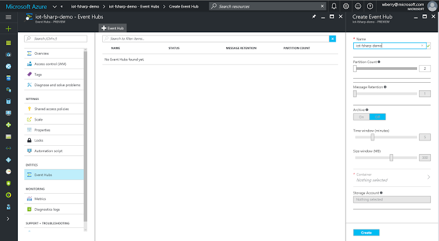

The new event hub will take a few minutes to deploy and will show up in the center pane of the image above.  Once the event hub is displayed, select it and scroll down to `Shared access policies`.  A new pane will open, select `+ Add` and create a new policy with `Manage` claims.  The blade should now refresh and present primary and secondary tokens as well as connection strings for those tokens. Select the primary connection string and paste it into a text editor - we'll need to modify it slightly before using it in our application. 

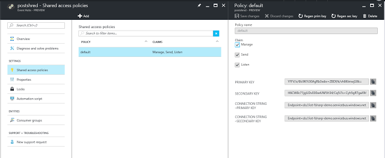


The connection string should look like this:

```
Endpoint=sb://{hub_service_name}.servicebus.windows.net/;SharedAccessKeyName=default;SharedAccessKey={key};EntityPath={hub_name}
```

Split the string at the last semi-color (`;EntityPath=...`) and place it on a second line for later use.

While we are gathering connection string data, let's pull the IoT Hub's Event Hub interface connection information.  Navigate back to the Portal Dashboard and select the IoT Hub.  Scroll down to `Messaging` which will open a second pane containing the Event Hub interface information for the IoT Hub.  Copy both the `Event Hub-compatible name` and the `Event Hub-compatible endpoint` strings and save them off to the aforementioned text file.


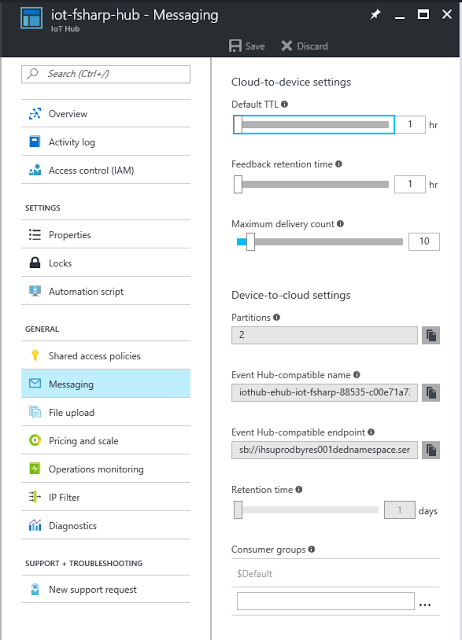

Navigate back to `Shared access policies`, select the `iothubowner` policy and copy the `Primary key` value into the text file.

## Azure Function 

With batched and compressed data flowing from the device simulator to IoT Hub, we now need an Azure Function that can decompress the message, shred the concatenated sensor data and re-post each individual message onto the new event hub we created in the previous section.  While Azure Functions are relatively straightforward, there are a number of steps to this process and many features are marked as being in `Preview` and/or `Experimental` - keep in mind that some things may be slightly different than shown below.

In the Portal, select the `+` icon in the top left and search for `Function App`. 

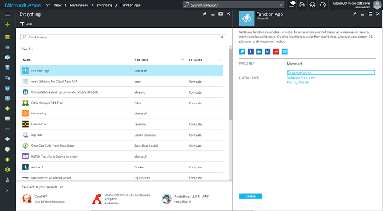

Press `Create` to kick off the deployment - the app should only take a few moments to create.

Once the Function App is deployed, a quick-start blade will present options to create C# and JavaScript functions.  Use the `+ New Function` tab in the upper left corner to reveal the full template list.  Using the language drop-down, filter for only F# templates and select the `EventHubTrigger-FSharp` template. 

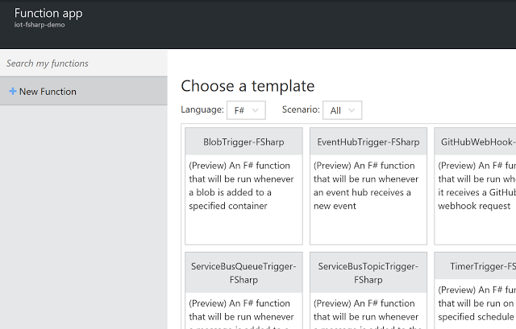


With the `EventHubTrigger-FSharp` template selected, a pane will show up below the templates prompting for input data. 

Give the function a name.  In the text box for `Event Hub name`, enter the `Event Hub-compatible name` from the IoT Hub that was saved off to your text file in the previous section. Continue by pressing the `new` button next to the `Event Hub connection` text box.  This will present a new blade where we'll enter the connection string for the Event Hub interface of the IoT Hub.


In the text file paste this template connection string and add the values saved off earlier:

```
Endpoint={Event Hub-compatible endpoint};SharedAccessKeyName=iothubowner;SharedAccessKey={iothubowner_primary_key}
```

The result should look like this:

```
Endpoint=sb://ihsuprodbyres001dednamespace.servicebus.windows.net;SharedAccessKeyName=iothubowner;SharedAccessKey=NWpfd9yzCX/qj1+tKGdMAsXa+7KZEJYVQ9Z9vZDAiBo=
```

Paste the connection string into the `Connection string` field and press `OK`.

Back in the template pane, press the `Create` button at the bottom of the blade.  The portal will present a run.fsx file, and likely some error messages that can safely be ignored for now. 

Select the `Integrate` tab under the Function and update the `Event parameter name` to `input` and press `Save`. 


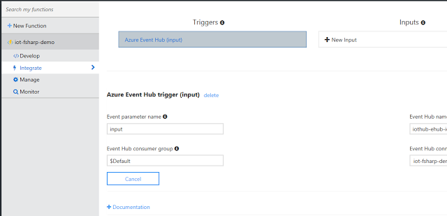


Click back to the `Develop` tab and update the Run function's first parameter name, as well as it's use in the log statement, to `input`.  Press `Save and run`.  The Function should compile and execute.


In order to post the shredded messages to our Event Hub, we'll need the WindowsAzure.ServiceBus Nuget package.  Thankfully, the Functions service provides an easy mechanism to add dependencies.  In the upper right corner of the Function work-space, select `View Files` and press `+Add` at the bottom of the newly presented pane.  Enter `project.json` and press `enter`.  Much like the ASPNET CORE projects, we can add project metadata, and dependencies, to the Function app using the project.json file.  The text below can be pasted into the project.json file, edited and saved, which will kick off the Nuget package restore process. 

```
{
    "name": "iot-fsharp-demo",
    "version": "0.0.1",
    "description": "Example decompression & shred Azure Function",
    "copyright": "Microsoft",
    "title": "Decompression & Shred Azure Function",
    "authors": ["Microsoft"],
    "language": "F#",
    "frameworks": {
        "net46":{
            "dependencies": {
                "WindowsAzure.ServiceBus": "3.4.0"
            }
        }
    }
}
```

Flip back to the run.fsx file and let's get working on the code for decompressing, shredding and re-posting of the simulated sensor data. 

Delete the existing contents of the `run.fsx` file and add in our reference directives and open expressions:

```
#r "Microsoft.ServiceBus.dll"
#r "System.Runtime.Serialization.dll"

open System
open System.Text
open System.IO
open System.Diagnostics
open System.IO.Compression
open Microsoft.ServiceBus.Messaging
open System.Runtime.Serialization
```

Bind two identifiers that will hold the target Event Hub name and connection string information from the previous section (the connection string we split on `EntityPath`).

```
let eventHubName = "postshred"
let connectionString = "Endpoint=sb://iot-fsharp-demo.servicebus.windows.net/;SharedAccessKeyName=default;SharedAccessKey=YFFV/x/6lc9KYi30AgRb3wbv+ZBDf/k/vh6KtmwjSXk="
```


Add in the `decompress` function we used in the `RegisterDevices` project and start the binding for the Functions `Run` function like so:

```
let decompress (data : string) = 
    let gzipBuffer = Convert.FromBase64String(data)
    (   use memoryStream = new MemoryStream()
        let dataLength = BitConverter.ToInt32(gzipBuffer, 0)
        memoryStream.Write(gzipBuffer, 4, gzipBuffer.Length - 4)
        let buffer = Array.zeroCreate<byte> (int(dataLength))
        memoryStream.Position <- 0L
        (   use zip = new GZipStream(memoryStream, CompressionMode.Decompress)
            zip.Read(buffer, 0, buffer.Length) |> ignore)
        Encoding.UTF8.GetString(buffer)
    )
```


The `Run` function needs to create an Event Hub client, decompress the input string, shred the batched sensor data and re-post each sensor measurement using the Event Hub client.  We can easily bind the decompressed data to an identifier in the run function and create the Event Hub client like so:

```
let Run (input: string, log: TraceWriter) = 
    let groupedData = decompress input
    let eventHubClient = EventHubClient.CreateFromConnectionString(connectionString, eventHubName)
```    


The last thing we need to do is split the grouped data on the `|` delimiter, iterate over the array result of that operation and ask the eventHubClient to `Send` each JSON payload. Here is the complete function code including the split and re-post. 

```
#r "Microsoft.ServiceBus.dll"
#r "System.Runtime.Serialization.dll"

open System
open System.Text
open System.IO
open System.Diagnostics
open System.IO.Compression
open Microsoft.ServiceBus.Messaging
open System.Runtime.Serialization

let eventHubName = "postshred"
let connectionString = "Endpoint=sb://iot-fsharp-demo.servicebus.windows.net/;SharedAccessKeyName=default;SharedAccessKey=YFFV/x/6lc9KYi30AgRb3wbv+ZBDf/k/vh6KtmwjSXk="

let decompress (data : string) = 
    let gzipBuffer = Convert.FromBase64String(data)
    (   use memoryStream = new MemoryStream()
        let dataLength = BitConverter.ToInt32(gzipBuffer, 0)
        memoryStream.Write(gzipBuffer, 4, gzipBuffer.Length - 4)
        let buffer = Array.zeroCreate<byte> (int(dataLength))
        memoryStream.Position <- 0L
        (   use zip = new GZipStream(memoryStream, CompressionMode.Decompress)
            zip.Read(buffer, 0, buffer.Length) |> ignore)
        Encoding.UTF8.GetString(buffer)
    )

let Run (input: string, log: TraceWriter) = 
    let groupedData = decompress input
    let eventHubClient = EventHubClient.CreateFromConnectionString(connectionString, eventHubName)
    
    groupedData.Split([|"|"|], StringSplitOptions.RemoveEmptyEntries)
    |> Array.iter (fun data -> 
        eventHubClient.Send(new EventData(Encoding.UTF8.GetBytes(data)))
        log.Info(sprintf "F# Queue trigger function processed: '%s'" data)
        )
```


Notice the added debug log statement that we can now use to test our function.  In the upper right corner of the Function page press `Test` to reveal a test pane.  Paste the following text into the `Request body` and press `Save and run`. 

```
{"location":{"Latitude":40.572785337127179,"Longitude":73.94234667988286,"Altitude":"NaN","HorizontalAccuracy":"NaN","VerticalAccuracy":"NaN","Speed":"NaN","Course":"NaN","IsUnknown":false},"deviceId":"DeviceId0","windSpeed":10.904973079871839,"obsTime":"2016-11-28T20:14:07.4050906Z"}|{"location":{"Latitude":40.77039546021787,"Longitude":73.936369994380513,"Altitude":"NaN","HorizontalAccuracy":"NaN","VerticalAccuracy":"NaN","Speed":"NaN","Course":"NaN","IsUnknown":false},"deviceId":"DeviceId1","windSpeed":8.9946743366283712,"obsTime":"2016-11-28T20:14:07.4050906Z"}|{"location":{"Latitude":40.802419980175664,"Longitude":74.137364620009123,"Altitude":"NaN","HorizontalAccuracy":"NaN","VerticalAccuracy":"NaN","Speed":"NaN","Course":"NaN","IsUnknown":false},"deviceId":"DeviceId2","windSpeed":11.084375593384902,"obsTime":"2016-11-28T20:14:07.4050906Z"}|{"location":{"Latitude":40.620429899604716,"Longitude":74.0377327342062,"Altitude":"NaN","HorizontalAccuracy":"NaN","VerticalAccuracy":"NaN","Speed":"NaN","Course":"NaN","IsUnknown":false},"deviceId":"DeviceId3","windSpeed":9.174076850141434,"obsTime":"2016-11-28T20:14:07.4050906Z"}|{"location":{"Latitude":40.70360108888142,"Longitude":73.8420657430119,"Altitude":"NaN","HorizontalAccuracy":"NaN","VerticalAccuracy":"NaN","Speed":"NaN","Course":"NaN","IsUnknown":false},"deviceId":"DeviceId4","windSpeed":11.263778106897966,"obsTime":"2016-11-28T20:14:07.4050906Z"}|{"location":{"Latitude":40.815168724564174,"Longitude":74.028574918004367,"Altitude":"NaN","HorizontalAccuracy":"NaN","VerticalAccuracy":"NaN","Speed":"NaN","Course":"NaN","IsUnknown":false},"deviceId":"DeviceId5","windSpeed":9.3534793636544968,"obsTime":"2016-11-28T20:14:07.4050906Z"}|{"location":{"Latitude":40.634263716975241,"Longitude":74.154688016340259,"Altitude":"NaN","HorizontalAccuracy":"NaN","VerticalAccuracy":"NaN","Speed":"NaN","Course":"NaN","IsUnknown":false},"deviceId":"DeviceId6","windSpeed":11.443180620411029,"obsTime":"2016-11-28T20:14:07.4050906Z"}|{"location":{"Latitude":40.632095640981504,"Longitude":73.928272253624172,"Altitude":"NaN","HorizontalAccuracy":"NaN","VerticalAccuracy":"NaN","Speed":"NaN","Course":"NaN","IsUnknown":false},"deviceId":"DeviceId7","windSpeed":9.5328818771675614,"obsTime":"2016-11-28T20:14:07.4050906Z"}|{"location":{"Latitude":40.8602118423841,"Longitude":73.917591851158747,"Altitude":"NaN","HorizontalAccuracy":"NaN","VerticalAccuracy":"NaN","Speed":"NaN","Course":"NaN","IsUnknown":false},"deviceId":"DeviceId8","windSpeed":11.622583133924092,"obsTime":"2016-11-28T20:14:07.4050906Z"}|{"location":{"Latitude":40.743483308358982,"Longitude":74.1206610716174,"Altitude":"NaN","HorizontalAccuracy":"NaN","VerticalAccuracy":"NaN","Speed":"NaN","Course":"NaN","IsUnknown":false},"deviceId":"DeviceId9","windSpeed":9.7122843906806242,"obsTime":"2016-11-28T20:14:07.4050906Z"}
```


The function app will re-compile and execute on the test data, producing a log output like so:


## Azure Stream Analytics 

With the Azure Function properly decompressing and shredding the IoT Hub data, and posting the results to our Event Hub, we can now focus on aiming our sensor data at PowerBI for display.  The easiest way to set up a properly shaped streaming dataset for PowerBI is to pass the Event Hub events through an Azure Stream Analytics Job (ASA).

Back in the Portal, select the `+` icon in the upper left corner and Search for `Stream Analytics`.  Select `Stream Analytics Job` and press `Create` in the new blade.

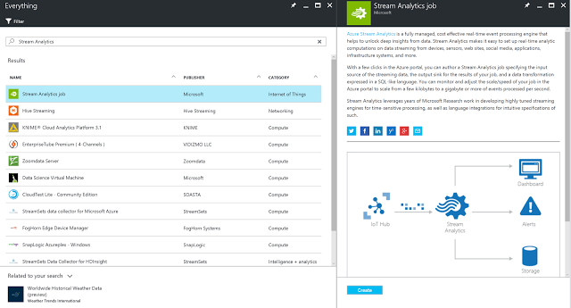

The Portal will present a new configuration blade that requires a `Job name`; be sure to add the job to the existing resource group for cleanup later. Press `Create` to kick off the deployment of the Stream Analytics Job.

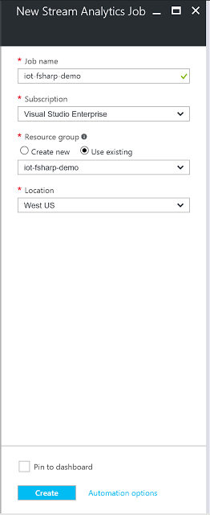

Once the deployment completes, select the `Inputs` tab of the ASA job.  Press the `+ Add` button at the top of the new pane and enter the following information:

* Input Alias - this will be the value we reference in the `from` field of the ASA query
* Source Type - set to `Data Stream`
* Source - select `Event Hub` from the drop down
* Subscription - select `Use event hub from current subscription`
* Service bus name - select the event hub service name created a few sections ago
* Event hub name - select the event hub name created in the previous event hub service
* Event hub policy name - select the policy that maps to the `Manage` policy 
* Event hub consumer group - leave blank to default to the `$Default` consumer group
* Event serialization format - select JSON from the dropdown
* Encoding - leave it set to `UTF-8`

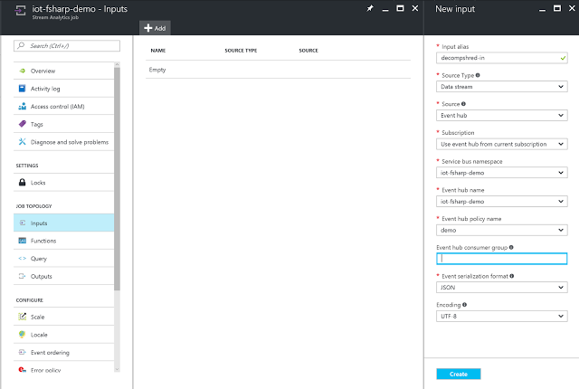

Press `Create` to complete the input definition.

Select the `Outputs` tab and press the `+ Add` button at the top of the pane.  Give the output alias a name and set the Sink to `Power BI`.  The portal will ask for Authorization to wire itself up to a PowerBi subscription.  If you don't already have a PowerBI account you can create one for free on the PowerBI Getting Started page.  

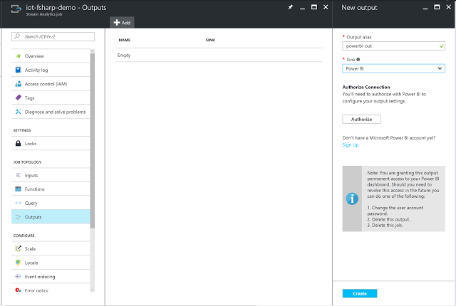

`Authorize` the Portal to connect to PowerBI which will re-direct you to an MSA login screen.  Once the login process is completed, the Portal will redirect you to complete wiring up the ASA job output.  For the `Group Workspace` drop-down select `My Workspace` and enter new names for the `DataSet Name` and `Table Name` fields.

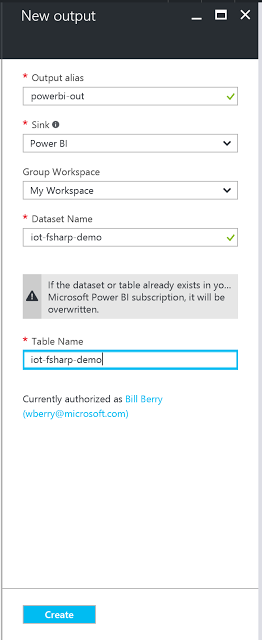

With the output defined we can complete the ASA job set up by building the query that will shape our data for PowerBI consumption.  Remember that our JSON sensor data is a complex data structure with the GeoCoordinate sub-type that will need to be flattened for PowerBI consumption. Select the `Query` tab of the ASA Job which will open a new pane with some default SQL'ish code.  Delete the existing query and enter the following:

```
SELECT
    location.Latitude,
    location.Longitude,
    windSpeed,
    deviceId,
    obsTime
INTO
    [powerbi-out]
FROM
    [decompshred-in]
```


This query will  create a new data object that flattens the location data, extracting just the Latitude and Longitude values along with the top level DeviceId, Wind Speed, and Observation Time values.

Navigate back to the ASA `Overview` tab and press `Start` at the top of the overview pane.  Note that ASA jobs are notoriously slow to start and stop ... be patient, it will eventually start.  

Flip back to Visual Studio, set the Device Simulator as the startup application and run it.  After a few minutes you should start to see Monitoring Events on the ASA overview page.


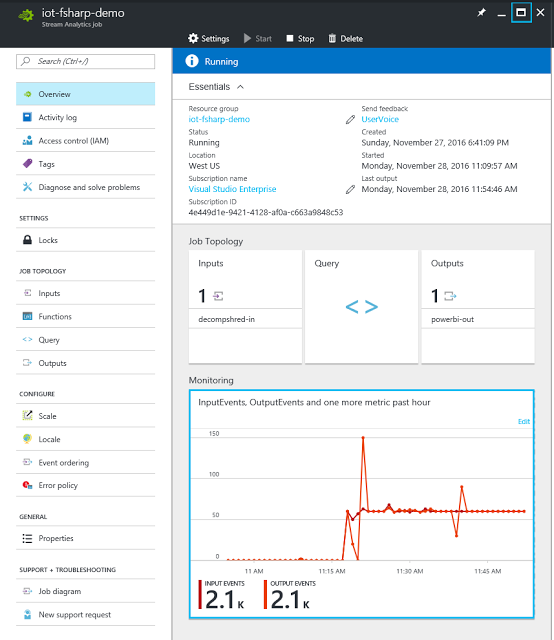

## Power BI

The final step in out F# & IoT exploration is to visualize our sensor data.  We'll leverage PowerBI to display geographic information and a historical line chart for the simulated sensors.

Log into PowerBI and in the left pane scroll down to `Datasets`, further selecting `Streaming datasets`.  This will bring up a menu of the available streaming dataset, one of which should be the output of the ASA job.


On the far right on the IoT dataset, press the `Create Report` icon.  You will be redirected to a new blank report.  From the Visualizations fly-out on the right, select the regular "Map" visualization.


To create the geographic map:

* Drag the `deviceId` Field into the Legend of the visualization
* Drag latitude to Latitude
* Drag longitude to Longitude
* Drag windspeed to Size, select the twill and set the value to the `Average` 

The resulting graph will look like this:


To generate the historical speed chart, add a line chart to the report and set the following values:

* Axis - osbTime
* Legend - deviceId
* Values - Average of windSpeed

With a bit of filtering you'll end up with a report like so:

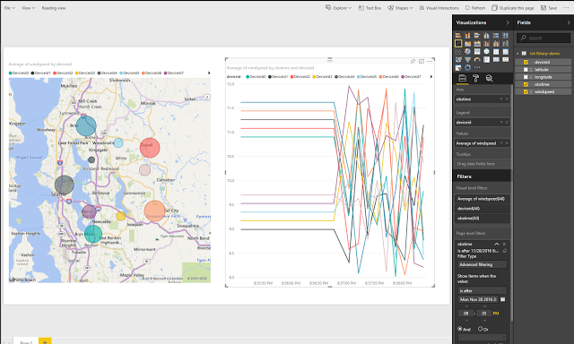

## Conclusion   

I hope this tutorial has illuminated some of the ways that F# fits nicely into the world of IoT, especially in the context of Cloud solutions. We've gone from data generation, through transmission; onto data post-processing and through visualization.  At each one of these steps are opportunities where F# and the community's F# tooling can play a deeper and more meaningful role.  And the best part of all this? ... Our community is only getting started.  We still have so much to say about topics like application correctness, developer productivity, and nearly every aspect of security. 

My final call to action, equally for those new and old to the language alike, is to stay involved, come listen to people speak or speak yourself, try out the libraries, unit test your C# code with F#, build pet projects, build complex systems, hell build the next Jet; but most of all, remember to enjoy writing code.  We write F# because it makes coding fun again, it pushes us to be better, it enables us to be better engineers/coders/developers.     


## Further Exercises

* Create functions across the demo applications that will build the connection string from its elements.
* Use Fable to create a custom PowerBI Visual.
* Create a simulator application and run on Raspbian on a Raspberry Pi
* Explore the Azure IoT Gateway SDK and compile a series of F# modules to run in the Gateway on Windows IoT Core
* Create and app that will tap the IoT Hub Event Hub interface and pull off a sampling of messages using EventProcessorHost 
* Test out the Cloud to Device Messaging, Device Management and Device Twin features of the Azure IoT SDK. 
